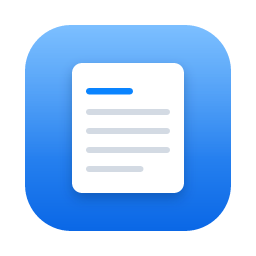
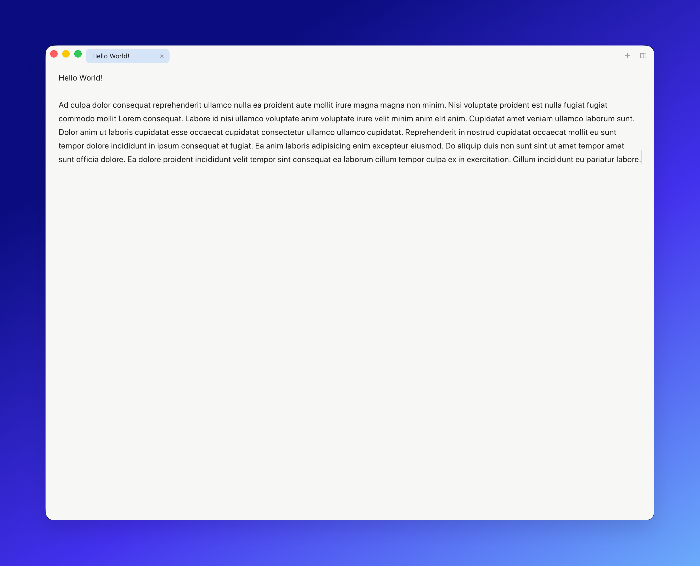

<div align="center">



# Jotter

**A fast, minimal notepad — a quiet place for quick thoughts.**

[](https://github.com/byurhannurula/jotter/releases/latest)

[](LICENSE)
[](https://tauri.app)

</div>

Open it and start typing. No "where do you want to save this?" dialog, no account, no cloud. Every scratch is auto‑kept in a local drafts store, so you never lose a note by starting a new one. When a draft graduates into a real file, `⌘S` gives it a home — the only time a save dialog appears.

Built with [Tauri 2](https://tauri.app) (Rust) + vanilla JS. Tiny bundle, native WebKit, instant startup.



> [!NOTE]
> Jotter is built for my **personal use on macOS**. Windows and Linux binaries are produced by CI but are **not tested** — they may work, but no promises. Bug reports and PRs are welcome.

## Features

- **Type instantly on launch** — a fresh page every time; past notes live in the sidebar
- **Autosaved drafts** — nothing is ever lost; browse and search them in the sidebar (`⌘B`)
- **Tabs** — VSCode‑style; `⌘T` new, `⌘W` close, `⌃Tab` to cycle
- **Markdown preview** — per‑tab Edit ⇄ Preview toggle (`⇧⌘P`)
- **Find & Replace** (`⌘F`)
- **Settings** — theme (system/light/dark), font (system/serif/mono/rounded), text size, word wrap
- **Native feel** — overlay titlebar, light/dark, remembers window size
- Small (~9 MB), fast, and everything stays on your machine

## Install

Download the latest build from the [**Releases**](https://github.com/byurhannurula/jotter/releases/latest) page.

Because the app isn't code‑signed / notarized (no paid developer accounts), the OS will warn on first launch:

- **macOS** — Gatekeeper blocks it. Open **System Settings → Privacy & Security**, scroll to the *"Jotter.app was blocked"* message, and click **Open Anyway** (authenticate, then confirm). It's trusted from then on. Or, from Terminal: `xattr -dr com.apple.quarantine /Applications/Jotter.app`. _(On macOS 14 and earlier you can instead right‑click the app → Open.)_
- **Windows** — SmartScreen may warn: **More info → Run anyway**.
- **Linux** — AppImage: `chmod +x Jotter*.AppImage` then run; or install the `.deb`.

## Usage

Open the app and just type — the current note autosaves as you go. Use the sidebar to revisit past notes and tabs to keep a few open at once.

| Shortcut | Action |
| --- | --- |
| `⌘N` / `⌘T` | New tab |
| `⌘W` | Close tab |
| `⌃Tab` / `⌃⇧Tab` | Next / previous tab |
| `⌘O` | Open a file into a new tab |
| `⌘S` / `⇧⌘S` | Save / Save As |
| `⌘B` | Toggle the drafts sidebar |
| `⇧⌘P` | Toggle markdown preview |
| `⌘F` · `⌘G` / `⇧⌘G` | Find · next / previous match |
| `⌘,` | Settings |

**How saving works**

- **Autosave** — changes are written ~400 ms after your last keystroke. There's no "unsaved" state.
- **Drafts store** — every note is a small JSON file in the app's data directory (`~/Library/Application Support/com.byrhn.jotter/drafts/`). A note appears in the sidebar as soon as it has content; empty, untouched notes are never saved.
- **Real files, on demand** — `⌘S` writes the current draft to a `.txt`/`.md` file wherever you choose. After that, autosave keeps that file up to date too.
- **Fresh page on launch** — opening the app always gives you a clean page; your previous notes are one click away in the sidebar.

## Build from source

**Prerequisites:** [Rust](https://rustup.rs) (stable), [Node.js](https://nodejs.org) 22+ and [pnpm](https://pnpm.io), plus the [Tauri prerequisites](https://tauri.app/start/prerequisites/) for your OS (Xcode Command Line Tools on macOS).

```bash
pnpm install
pnpm tauri dev      # hot-reloading dev build
pnpm tauri build    # release bundle → src-tauri/target/release/bundle/
pnpm ship           # macOS: build + copy Jotter.app to /Applications
```

**Tests:**

```bash
pnpm test                   # Vitest — pure logic (title/preview/search/…)
cd src-tauri && cargo test  # Rust unit tests (store/serde)
```

## Project structure

```
src/                  frontend (vanilla JS, no framework)
  main.js             app logic (drafts, tabs, find, settings, preview)
  lib/text.js         pure helpers (unit-tested)
  lib/meta.js         app name + author links (edit here for the About dialog)
src-tauri/src/lib.rs  Rust host: drafts store commands + native menu
.github/workflows/    cross-platform release CI
```

## Roadmap

Small things under consideration — ideas and PRs welcome:

- [ ] Status bar — line/column + word & character count
- [ ] Reopen last closed tab (`⌘⇧T`)
- [ ] Quick draft switcher (`⌘P`)
- [ ] Export / "Reveal in Finder" for a draft
- [ ] Configurable editor margins (Cozy / Wide)
- [ ] Soft-delete — undo an accidental draft delete
- [ ] Auto-update (Tauri updater)
- [ ] Homebrew cask install

## Author

Made by **Byurhan Nurula** — [website](https://byurhannurula.com/) · [X](https://x.com/byurhannurula)
